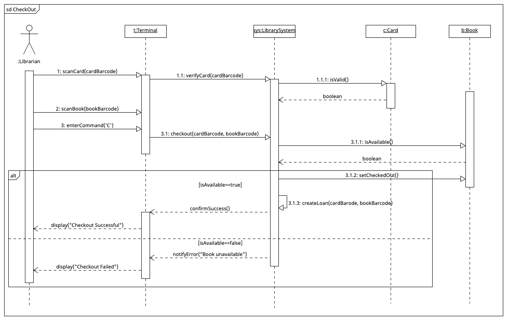

# CS 200 Lab 5 (Sequence Diagrams)
## Check Out Book Sequence Diagram

Here are a few important points to help you understand the diagram:

* **Nested Decimal Numbering (`1`, `1.1`, `1.1.1`):** Main actions initiated by the actor start with whole numbers (`1`, `2`, `3`). Sub-numbers (like `1.1.1` or `3.1.1`) indicate **nested sub-calls** triggered internally by a parent method while its activation bar is active.
* **Unnumbered Dashed Arrows (`<..........`):** Dashed arrows represent **return values or control returning** to the caller (e.g., passing a `boolean` back). Because they respond to existing calls (they're not new method calls), they don't receive message numbers.
* **Role of `sys : LibrarySystem`:** The `sys` object acts as the **central system controller **. It coordinates business logic between the terminal interface (`t : Terminal`) and individual domain objects (`c : Card`, `b : Book`).
* **`alt` Fragment Logic:** The `alt` frame represents conditional branching (`if-else` logic):
  * **Top Section (`[isAvailable == true]`):** Main success path (updates book state, logs the loan, and displays success).
  * **Bottom Section (`[isAvailable == false]`):** Error path (sends an error message and updates the terminal display).
